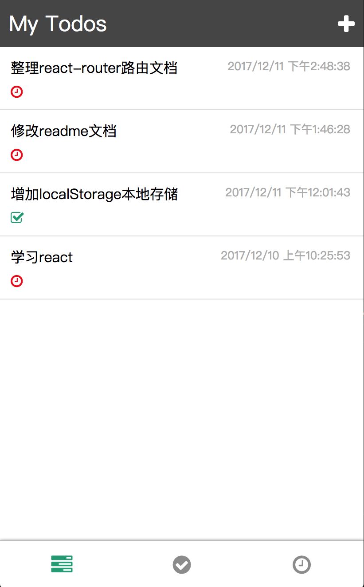
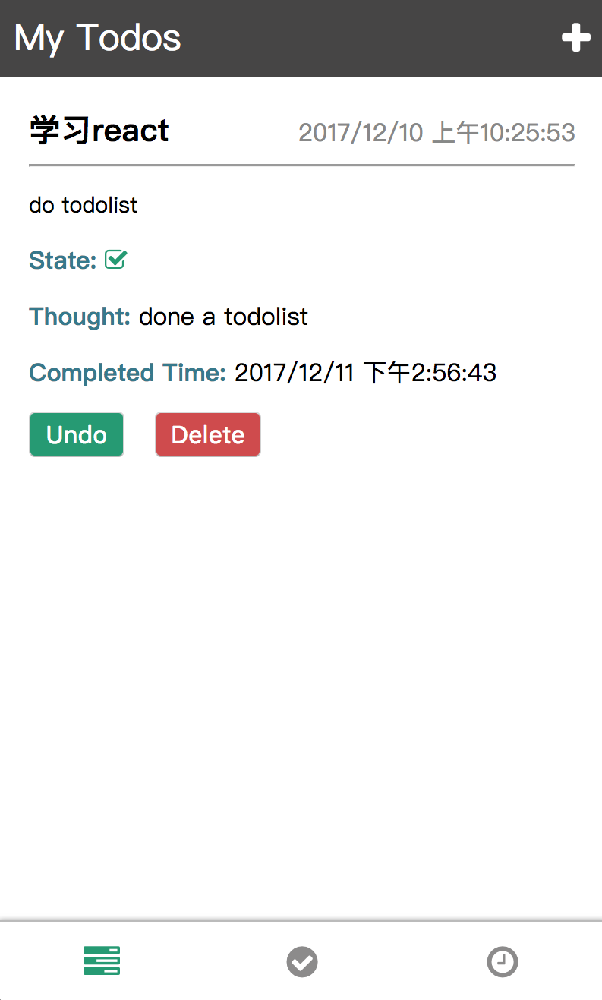
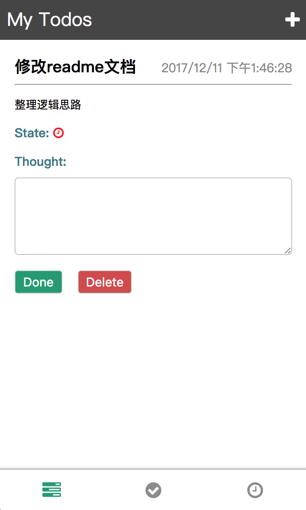
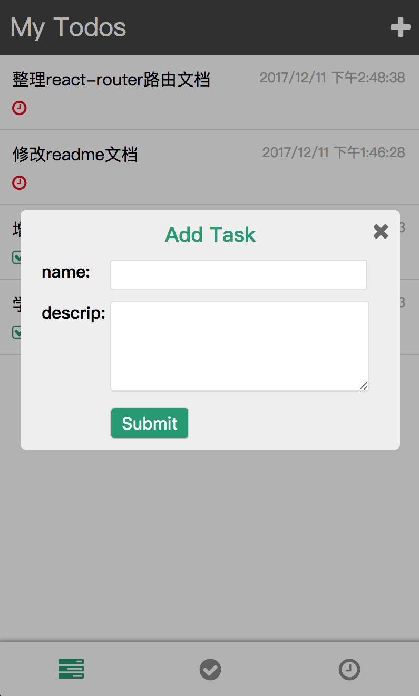
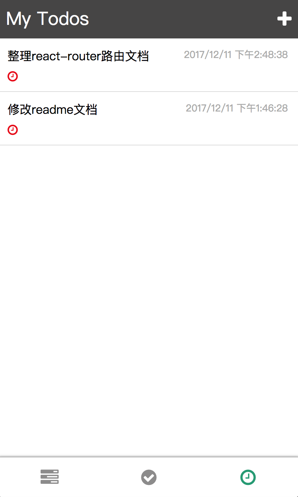

## React练手项目-todolist
### 所用技术
框架：React  
路由：react-router@V4   
图标：font-awesome     

### 项目结构
```
.
├── README.md
├── build
├── package-lock.json
├── package.json
├── public
│   ├── favicon.ico
│   ├── index.html
│   └── manifest.json
├── src
│   ├── App.css
│   ├── App.js    //主页面
│   ├── App.test.js
│   ├── component    
│   │   ├── AddTodo.css
│   │   ├── AddTodo.js   //新增todo组件
│   │   ├── TodoDetail.css   
│   │   └── TodoDetail.js    //todo详情组件
│   ├── index.css
│   ├── index.js   //页面入口
│   └── registerServiceWorker.js
└── yarn.lock

8 directories, 31 files

```

### overview
{:width="50%"}




## 如何运行

### 安装
$npm install

### 启动
$npm start


### 项目记录
- npm全局安装的模块放在 /usr/local/lib/node_modules/ 目录下
- 不要直接对state进行修改，例如数组的一些方法会直接修改原数组
- react-router4.*版本使用browerHistory的方法：[https://github.com/brickspert/blog/issues/3](https://github.com/brickspert/blog/issues/3)
- 安装history[https://github.com/ReactTraining/history](https://github.com/ReactTraining/history)
```
  const history = createHistory({  
  forceRefresh: true,  
})
```
这样可以方便使用history，但页面跳转时是自动刷新的；
- 事件函数的参数传递onClick={this.handleClick.bind(this,传递的参数)}
- JSON.stringify 和 JSON.parse 可以转换对象数组；

### 问题
- 划分组件时，由于各个组件之前是有联系的，即 可能相互传数据，如果把其纳入一个组件会减少组件间通信，但是又会让组件显得在UI上划分不合理。如何做一个平衡？

### 项目逻辑
1. 组件划分(根据UI)
2. 状态state考虑(涉及到页面数据展示和页面变化)  
1）页面展示的数据需要state来维护，即todo数组，数组每个对象会维护多个属性；   
2）页面task，completed，active图标和相关todolist的展示，可以用一个状态来维护，即classify，这样可以同时控制图标的展示和相应todolist的展示；      
3) 状态isAdd，表示是否新增todo，控制css类名变化，即控制页面的显示；   
3. 路由  
页面路由采用react-router@V4，即不同UI组件的显示，就需要路由，而页面底部页面task，completed，active图标三种界面显示，都是相同组件源，可用state控制其显示，就不用路由。  
  涉及路由的页面：todos清单页面 / 增加todo页面 / 单个todo详情页面    
  路由思路：将三个页面放在主页面Router的Route组件下，设置其path，当页面发生点击事件时，利用history修改path，react-router便会根据页面的path无刷新跳转相应组件  
4. 涉及state的逻辑处理
将todo对象数组的所有状态维护在主页面，由于这些状态会在三个路由页面进行状态交互，所以维护在共同祖先组件，便于通信。在子组件中绑定元素的响应事件，通知到主页面进行state的更新，同时更新本地化存储localStorage。

### 踩坑
1. 描述：history.push之后页面路径会变化，但没有跳转。所以加了forceRefresh:true的初始化参数，强制每次路径变化刷新页面。这样页面就才会有刷新。     
   解决方法：主要我之前采用的import { BrowserRouter as Router } 加 ```<Router></Router>```的方式，现在采用```<Router history={history}></Router>```这种方式，就可以默认跳转了。
 

